## System Architecture

## Documentation Version
- Current: v1.4.6
- Last updated: 2026-03-26
- Owner: Core&Co Team
- Changelog: [CHANGELOG.md](../CHANGELOG.md)

## Entity Relationship Diagram (ERD)

```mermaid
erDiagram
  %% =========================
  %% USERS / AUTH (Customer)
  %% =========================
  USER {
    bigint user_id PK
    varchar email UK
    varchar password_hash
    varchar first_name
    varchar last_name
    date date_of_birth
    varchar phone_number
    enum preferred_language "TH|EN"
    datetime email_verified_at "nullable"
    datetime created_at
    datetime updated_at
  }

  EMAIL_VERIFICATION_TOKEN {
    bigint email_verification_token_id PK
    bigint user_id FK
    varchar token UK
    datetime expires_at
    datetime used_at "nullable"
    datetime created_at
  }

  PASSWORD_RESET_TOKEN {
    bigint password_reset_token_id PK
    bigint user_id FK
    varchar token UK
    datetime expires_at
    datetime used_at "nullable"
    datetime created_at
  }

  SESSION {
    bigint session_id PK
    bigint user_id FK
    varchar session_token UK
    datetime expires_at
    datetime revoked_at "nullable"
    datetime created_at
    datetime updated_at
  }

  %% =========================
  %% ADMIN (Separate table)
  %% =========================
  ADMIN {
    bigint admin_id PK
    varchar email UK
    varchar password_hash
    varchar first_name
    varchar last_name
    boolean is_active
    datetime created_at
    datetime updated_at
  }

  %% =========================
  %% CATEGORIES + LOCALIZATION
  %% =========================
  CATEGORY {
    bigint category_id PK
    bigint parent_category_id FK
    varchar category_name
    varchar slug UK
    boolean is_hidden
    datetime created_at
    datetime updated_at
  }

  CATEGORY_TRANSLATION {
    bigint category_translation_id PK
    bigint category_id FK
    enum language_code "TH|EN"
    varchar name
  }

  %% =========================
  %% PRODUCTS
  %% =========================
  PRODUCT {
    bigint product_id PK
    varchar product_type "TOP|BOTTOM|ACCESSORY"
    boolean is_active
    datetime created_at
    datetime updated_at
  }

  PRODUCT_TRANSLATION {
    bigint product_translation_id PK
    bigint product_id FK
    varchar language_code "TH|EN"
    varchar name
    text description
  }

  PRODUCT_CATEGORY {
    bigint product_category_id PK
    bigint product_id FK
    bigint category_id FK
    boolean is_primary
  }

  PRODUCT_VARIANT {
    bigint product_variant_id PK
    bigint product_id FK
    varchar sku_code UK
    varchar colour
    varchar size
    decimal price
    decimal compare_at_price "optional original price"
    int stock_qty
    boolean is_active
    datetime created_at
    datetime updated_at
  }

  PRODUCT_VARIANT_ATTRIBUTE {
    bigint product_variant_attribute_id PK
    bigint product_variant_id FK
    varchar attr_key
    varchar attr_value
    varchar unit
  }

  PRODUCT_MEDIA {
    bigint product_media_id PK
    bigint product_id FK
    varchar bucket_name
    varchar file_path
    varchar public_url
    varchar alt_text "nullable"
    boolean is_thumbnail
    boolean is_hero
    int sort_order
    datetime created_at
  }

  %% =========================
  %% CART
  %% =========================
  CART {
    bigint cart_id PK
    bigint user_id FK
    varchar status "ACTIVE|CONVERTED|ABANDONED"
    datetime created_at
    datetime updated_at
  }

  CART_ITEM {
    bigint cart_item_id PK
    bigint cart_id FK
    bigint product_variant_id FK
    int quantity
    datetime created_at
    datetime updated_at
  }

  WISHLIST {
    bigint wishlist_id PK
    bigint user_id FK
    bigint product_id FK
    datetime created_at
  }

  %% =========================
  %% ADDRESSES
  %% =========================
  ADDRESS {
    bigint address_id PK
    bigint user_id FK
    varchar full_name
    varchar phone
    varchar line1
    varchar line2
    varchar district
    varchar province
    varchar postcode
    varchar country
    boolean is_default_shipping
    boolean is_default_billing
    datetime created_at
    datetime updated_at
  }

  %% =========================
  %% ORDERS + RECEIPTS (No payment gateway required)
  %% =========================
  ORDERS {
    bigint order_id PK
    bigint user_id FK
    bigint shipping_address_id FK
    bigint billing_address_id FK
    varchar status "PURCHASED"
    decimal subtotal
    decimal shipping_fee
    decimal vat_amount
    decimal total
    text shipping_address_snapshot
    text billing_address_snapshot
    datetime created_at
    datetime updated_at
  }

  ORDER_ITEM {
    bigint order_item_id PK
    bigint order_id FK
    bigint product_variant_id FK
    varchar snapshot_product_name
    varchar snapshot_color
    varchar snapshot_size
    decimal snapshot_unit_price
    decimal snapshot_compare_at_price
    int quantity
    decimal line_total
  }

  RECEIPT {
    bigint receipt_id PK
    bigint order_id FK
    varchar receipt_number UK
    varchar status "ISSUED|SENT|VOID"
    decimal amount
    varchar currency "THB"
    varchar delivery_method "EMAIL|DOWNLOAD"
    varchar file_url
    datetime issued_at
    datetime sent_at
  }

  RECEIPT_EMAIL_LOG {
    bigint receipt_email_log_id PK
    bigint receipt_id FK
    varchar to_email
    varchar status "QUEUED|SENT|FAILED"
    text error_message
    datetime created_at
  }

  %% =========================
  %% REVIEWS (with media, replies, likes)
  %% =========================
  REVIEW {
    bigint review_id PK
    bigint product_id FK
    bigint user_id FK
    boolean verified_purchase
    int rating
    text comment
    varchar status "VISIBLE|HIDDEN|DELETED"
    datetime created_at
    datetime updated_at
  }

  REVIEW_MEDIA {
    bigint review_media_id PK
    bigint review_id FK
    varchar url
    varchar media_type "image|video"
    int sort_order
  }

  REVIEW_REPLY {
    bigint review_reply_id PK
    bigint review_id FK
    bigint admin_id FK
    text reply_text
    datetime created_at
  }

  REVIEW_LIKE {
    bigint review_like_id PK
    bigint review_id FK
    bigint admin_id FK
    datetime created_at
  }

  %% =========================
  %% CHAT (human admin only)
  %% =========================
  CONVERSATION {
    bigint conversation_id PK
    bigint user_id FK
    varchar status "OPEN|CLOSED"
    datetime created_at
    datetime updated_at
  }

  MESSAGE {
    bigint message_id PK
    bigint conversation_id FK
    varchar sender_type "USER|ADMIN"
    bigint sender_user_id "nullable"
    bigint sender_admin_id "nullable"
    text message_text
    varchar message_type "TEXT|IMAGE"
    datetime created_at
    datetime read_at
  }

  %% =========================
  %% ANALYTICS EVENTS
  %% =========================
  ANALYTICS_EVENT {
    bigint event_id PK
    bigint user_id FK "nullable"
    varchar session_id
    varchar event_type "PURCHASE|PRODUCT_VIEW|PRODUCT_COMMENT|PRODUCT_LIKE|SEARCH|WISHLIST|CART|CHECKOUT_ATTEMPT|REVIEW_INTERACTION"
    bigint product_id FK "nullable"
    bigint product_variant_id FK "nullable"
    bigint cart_id FK "nullable"
    bigint order_id FK "nullable"
    bigint review_id FK "nullable"
    varchar search_query "nullable"
    int event_count
    decimal event_value "nullable"
    json metadata_json "nullable"
    datetime created_at
  }

  %% =========================
  %% RELATIONSHIPS
  %% =========================
  CATEGORY ||--o{ CATEGORY : parent_of
  CATEGORY ||--o{ CATEGORY_TRANSLATION : has

  USER ||--o{ EMAIL_VERIFICATION_TOKEN : uses_email_verification
  USER ||--o{ PASSWORD_RESET_TOKEN : uses_password_reset
  USER ||--o{ SESSION : authenticates_with

  PRODUCT ||--o{ PRODUCT_TRANSLATION : has
  PRODUCT ||--o{ PRODUCT_MEDIA : has
  PRODUCT ||--o{ PRODUCT_VARIANT : has
  PRODUCT_VARIANT ||--o{ PRODUCT_VARIANT_ATTRIBUTE : has

  PRODUCT ||--o{ PRODUCT_CATEGORY : tagged_as
  CATEGORY ||--o{ PRODUCT_CATEGORY : contains

  USER ||--o{ WISHLIST : favorites
  PRODUCT ||--o{ WISHLIST : saved_in

  USER ||--o{ CART : owns
  CART ||--o{ CART_ITEM : contains
  PRODUCT_VARIANT ||--o{ CART_ITEM : added_as

  USER ||--o{ ADDRESS : has

  USER ||--o{ ORDERS : places
  ORDERS ||--o{ ORDER_ITEM : includes
  PRODUCT_VARIANT ||--o{ ORDER_ITEM : snapshot_of
  ORDERS }o--|| ADDRESS : uses_shipping
  ORDERS }o--|| ADDRESS : uses_billing

  ORDERS ||--o{ RECEIPT : generates
  RECEIPT ||--o{ RECEIPT_EMAIL_LOG : email_logs

  USER ||--o{ REVIEW : writes
  PRODUCT ||--o{ REVIEW : receives
  REVIEW ||--o{ REVIEW_MEDIA : has
  REVIEW ||--o{ REVIEW_REPLY : replied_by
  ADMIN ||--o{ REVIEW_REPLY : replies
  REVIEW ||--o{ REVIEW_LIKE : liked_by
  ADMIN ||--o{ REVIEW_LIKE : likes

  USER ||--o{ CONVERSATION : starts
  CONVERSATION ||--o{ MESSAGE : contains
  USER ||--o{ MESSAGE : sends
  ADMIN ||--o{ MESSAGE : sends

  USER ||--o{ ANALYTICS_EVENT : records
  PRODUCT ||--o{ ANALYTICS_EVENT : product_events
  PRODUCT_VARIANT ||--o{ ANALYTICS_EVENT : variant_events
  CART ||--o{ ANALYTICS_EVENT : cart_events
  ORDERS ||--o{ ANALYTICS_EVENT : order_events
  REVIEW ||--o{ ANALYTICS_EVENT : review_events

```

## Constraints & Data Integrity Rules

- Unique constraints: `USER.email`, `PRODUCT_VARIANT.sku_code`, `WISHLIST(user_id, product_id)`, `EMAIL_VERIFICATION_TOKEN.token`, `PASSWORD_RESET_TOKEN.token`, `SESSION.session_token`.
- Exactly one `PRODUCT_MEDIA.is_thumbnail = true` per product.
- Exactly one `PRODUCT_MEDIA.is_hero = true` per product.
- `PRODUCT_MEDIA` supports up to 4 images per product via `sort_order` range `1..4` with unique `(product_id, sort_order)`.
- Exactly one `PRODUCT_CATEGORY.is_primary = true` per product.
- `EMAIL_VERIFICATION_TOKEN` enforces expiration via `expires_at` and single-use via `used_at` (set once when redeemed).
- `PASSWORD_RESET_TOKEN` enforces expiration via `expires_at` and single-use via `used_at` (set once when redeemed).
- `REVIEW.rating` must be within `1..5`.
- Only purchased users can submit reviews (enforced by application/business rule).
- One **ACTIVE** cart per user (enforced via application logic and/or a DB strategy such as a unique active-cart rule).
- `REVIEW_LIKE` must be unique on `(review_id, admin_id)` to prevent double-like.
- `REVIEW_MEDIA` enables filtering “reviews with images”.
- `RECEIPT.order_id` can be unique if the system issues only one receipt per order (otherwise allow multiple receipts with different versions/status).
- ON DELETE behavior: `CATEGORY.parent_category_id -> SET NULL`; translations/media/join tables cascade from parent; `USER -> CART`, `CART -> CART_ITEM`, `USER/PRODUCT -> WISHLIST`, and `USER -> EMAIL_VERIFICATION_TOKEN/PASSWORD_RESET_TOKEN/SESSION` use `CASCADE`.
- ON DELETE behavior (history-safe): `ORDERS.shipping_address_id` and `ORDERS.billing_address_id` use `SET NULL` while snapshots preserve historical addresses; `ORDER_ITEM.product_variant_id` can use `SET NULL` while snapshot fields preserve purchase context.
